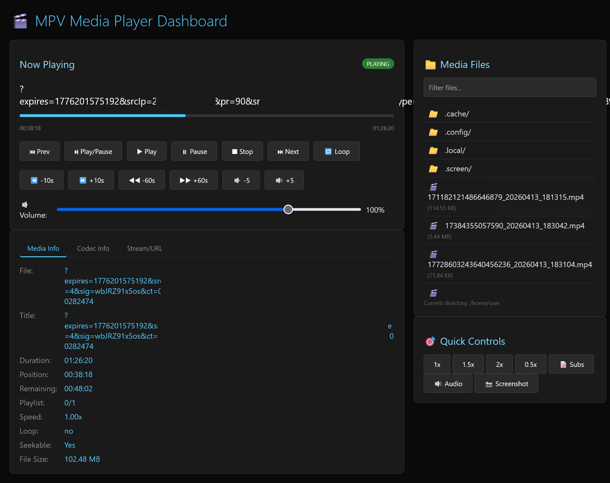
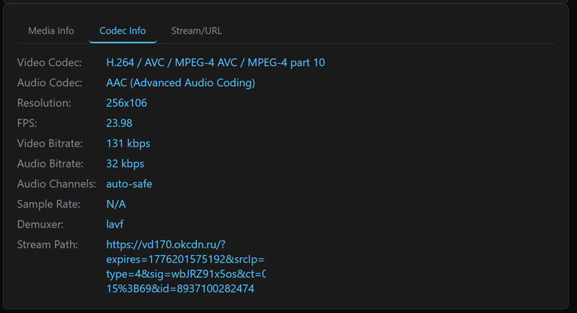
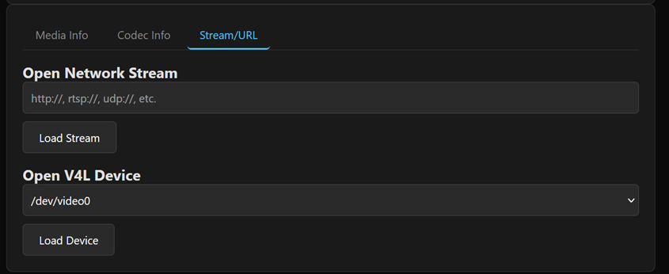
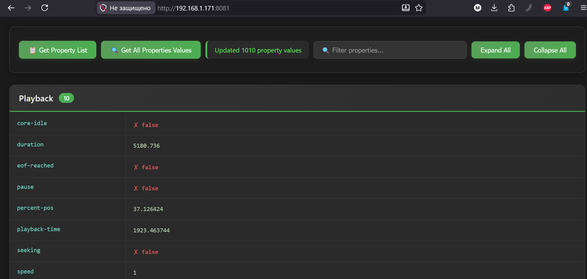
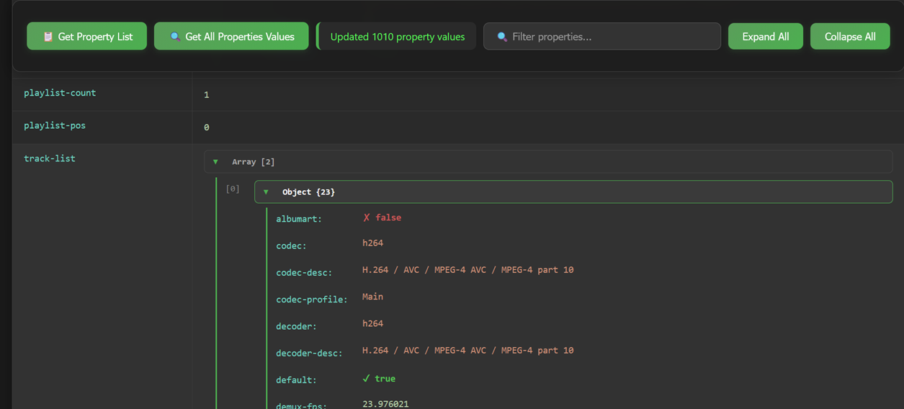

# mpv-webgui-dashboard
WebGUI Dashboard for MPV via socket RPC JSON on Python 3

# MPV Web Dashboard

A lightweight web-based remote control and monitoring dashboard for MPV media player using JSON IPC protocol. Perfect for embedded systems, HTPCs, and headless media servers.





## ✨ Features

### 🎮 Full Playback Control
- Play, pause, stop, next/previous track
- Seek forward/backward (±10s, ±60s)
- Clickable progress bar for instant seeking
- Volume control with mute indicator
- Playback speed adjustment (0.5x - 2.0x)
- Loop mode cycling (none/infinite)
- Screenshot capture

### 📊 Real-time Media Monitoring
- Current playback status (playing/paused/stopped)
- Position and remaining time display
- Comprehensive media information
- Detailed codec information:
  - Video/audio codec names
  - Resolution and FPS
  - Bitrate statistics
  - Audio channels and sample rate
- Playlist position tracking

### 📁 Multiple Source Support
- **Local files**: Browse and play media from current directory
- **Network streams**: HTTP, RTSP, UDP, HLS, and more
- **V4L devices**: Direct playback from video capture devices (/dev/video*)
- Automatic playlist generation from directory contents
- File filtering and type indicators

### 🎯 Additional Features
- Subtitle toggle
- Audio track cycling
- Dark theme with responsive design
- Tabbed interface for organized information
- Auto-refresh status every 1s
- System audio unmute on playback start (amixer integration)
- Automatic MPV process recovery

## 🔧 Requirements

### System Requirements
- Python 3.14 or higher
- MPV media player (with JSON IPC support)
- Linux/Unix-based OS (uses Unix domain sockets)
- X11 display server (or Wayland with XWayland)

### Optional
- `amixer` (ALSA mixer) for audio unmute feature
- V4L2 devices support (requires MPV built with v4l2 support)
- user-agent="Gecko/" for VK video OK video support

### Python Dependencies
All dependencies are from Python standard library:
- `http.server` - Web server
- `socket` - IPC communication
- `json` - Command serialization
- `subprocess` - MPV process management
- `pathlib` - File system operations
- `select` - Socket I/O multiplexing

**No external pip packages required!**

## 📦 Installation

1. Clone the repository:
```bash
git clone https://github.com/mpv-webgui-dashboard.git
cd mpv-web-dashboard
```

2. Make the script executable:
```bash
chmod +x mpv_server_socket.py
```

3. Run the dashboard:
```bash
./mpv_server_socket.py
```

4. Open your browser and navigate to:
```
http://192.168.0.100:8080
```

## 🚀 Usage

### Starting the Dashboard
```bash
# Default configuration
./mpv_server_socket.py

# Custom DISPLAY (if needed)
DISPLAY=:1 ./mpv_server_socket.py
```

### Web Interface
The dashboard provides intuitive controls:
- **Main Panel**: Playback controls and progress bar
- **Media Info Tab**: General file information
- **Codec Info Tab**: Technical codec details
- **Stream Tab**: URL input and V4L device selection
- **Side Panel**: File browser and quick controls

### Keyboard Shortcuts (via Web UI)
| Button | Action |
|--------|--------|
| Play/Pause | Toggle playback |
| Prev/Next | Navigate playlist |
| Stop | Stop playback |
| -10s/+10s | Quick seek |
| -60s/+60s | Long seek |
| Loop | Cycle loop modes |

### Configuration
Edit these variables at the top of `mpv_server_socket.py`:
```python
MPV_SOCKET = "/tmp/mpv-web-socket"  # IPC socket path
HTTP_HOST = "0.0.0.0"                # Listen on all interfaces
HTTP_PORT = 8080                     # Web server port
DISPLAY_ENV = ":0"                   # X11 display for MPV
```

## 🔌 API Endpoints

| Endpoint | Method | Description |
|----------|--------|-------------|
| `/` | GET | Web dashboard interface |
| `/api/status` | GET | Current playback status (JSON) |
| `/api/files` | GET | List media files in current directory |
| `/api/v4l` | GET | List available V4L devices |
| `/api/command` | POST | Send commands to MPV |

### Command API Example
```javascript
// Play a file
fetch('/api/command', {
    method: 'POST',
    body: new FormData({
        command: 'loadfile',
        params: JSON.stringify({path: '/path/to/video.mp4'})
    })
});

// Seek forward 10 seconds
fetch('/api/command', {
    method: 'POST',
    body: new FormData({
        command: 'seek',
        params: JSON.stringify({seconds: 10, mode: 'relative'})
    })
});
```

## 🛠️ Architecture

```
┌─────────────────┐     HTTP      ┌──────────────┐     JSON IPC    ┌─────┐
│   Web Browser   │ ◄────────────► │ Python Web   │ ◄─────────────► │ MPV │
│   (Dashboard)   │                │   Server     │                 │     │
└─────────────────┘                └──────────────┘                 └─────┘
                                          │
                                          ▼
                                   ┌──────────────┐
                                   │  amixer      │
                                   │ (Audio Ctrl) │
                                   └──────────────┘
```

## 🐛 Troubleshooting

### MPV not starting
- Ensure MPV is installed: `which mpv`
- Check if DISPLAY is accessible: `echo $DISPLAY`
- Verify socket permissions in `/tmp/`

### Socket connection errors
- Remove stale socket: `rm /tmp/mpv-web-socket`
- Check if MPV process is running: `ps aux | grep mpv`

### No V4L devices found
- Install v4l-utils: `sudo apt install v4l-utils`
- List devices manually: `ls -la /dev/video*`
- Check MPV v4l2 support: `mpv --demuxer=help | grep v4l2`

### Audio unmute not working
- Install alsa-utils: `sudo apt install alsa-utils`
- Find correct numid: `amixer controls`
- Adjust numid in code if needed

## 📝 License

MIT License - feel free to use, modify, and distribute.

## 🤝 Contributing

Contributions are welcome! Please feel free to submit pull requests.

### Development Guidelines
- Keep dependencies minimal (standard library only)
- Maintain dark theme consistency
- Add comments for complex logic
- Test with various media formats

## 🎯 Use Cases

- **HTPC Remote Control**: Control your home theater PC from any device
- **Headless Media Server**: Manage playback on a server without monitor
- **Embedded Systems**: Run on Raspberry Pi or NVIDIA Jetson
- **Digital Signage**: Remote management of display content
- **Development/Debugging**: Monitor MPV properties in real-time

## 📊 Performance

- Lightweight: ~15MB RAM usage (excluding MPV)
- Low CPU overhead: <1% when idle
- Network efficient: Only ~2KB per status update
- Responsive UI: 60fps animations, 500ms update interval

## 🔐 Security Note

This dashboard is designed for local network use. If exposing to the internet:
- Use a reverse proxy with HTTPS
- Implement authentication
- Consider firewall rules
- Run as non-root user

## 🙏 Acknowledgments

- MPV project for the excellent media player
- Python standard library for making this possible without external deps
- ALSA project for audio control capabilities

## 📞 Support

For issues and questions:
- Open an issue on GitHub
- Check the [MPV IPC documentation](https://mpv.io/manual/stable/#json-ipc)
- Review the [MPV property list](https://mpv.io/manual/stable/#property-list)

---
Made with ❤️ for the open-source community

# MPV Property Inspector

A lightweight web-based property inspector for MPV media player with real-time property viewing and nested JSON structure visualization.


## 📋 Table of Contents

- [Features](#-features)
- [Requirements](#-requirements)
- [Installation](#-installation)
- [Usage](#-usage)
- [API Endpoints](#-api-endpoints)
- [Configuration](#-configuration)
- [Property Categories](#-property-categories)
- [Troubleshooting](#-troubleshooting)
- [Limitations](#-limitations)
- [Contributing](#-contributing)
- [License](#-license)

## ✨ Features

- **Property List Browser** - Fetch and display all available MPV properties grouped by category
- **Real-time Property Values** - Query all property values with a single click
- **Smart Grouping** - Properties are automatically organized into 65+ logical categories:
  - Playback State
  - Video/Audio Info & Performance
  - Subtitles (Main, ASS/SSA, Styling, Filters)
  - Tracks & Chapters
  - Window & Display Settings
  - Hardware Decoding & GPU Rendering
  - Network & Streaming
  - And many more...
- **Nested JSON Visualization** - Complex nested objects and arrays are rendered as inline HTML tables for easy reading
- **Clean Web Interface** - Dark theme, responsive design, sticky controls
- **Zero Dependencies** - Pure Python standard library implementation

## 📸 Screenshots



## 📦 Requirements

- **Python** 3.14 or higher
- **MPV** media player (with IPC socket support)
- Modern web browser (Chrome, Firefox, Safari, Edge)

## 🔧 Installation

```bash
# Clone the repository
git clone https://github.com/ZalgoSoft/mpv-webgui-dashboard.git
cd mpv-property-inspector

# Make the script executable
chmod +x mpv_prop.py
```

## 🚀 Usage

### Step 1: Start MPV with IPC socket

```bash
# Start MPV with socket
mpv --input-ipc-server=/tmp/mpv-web-socket your_video_file.mp4

# Or start in idle mode (no file)
mpv --input-ipc-server=/tmp/mpv-web-socket --idle
```

**Permanent configuration** - Add to your `~/.config/mpv/mpv.conf`:
```
input-ipc-server=/tmp/mpv-web-socket
```

### Step 2: Run the web server

```bash
python3 mpv_prop.py
```

### Step 3: Open in browser

Navigate to: **`http://192.168.0.100:8081`**

### Step 4: Use the interface

1. Click **"Get Property List"** to load and categorize all available properties
2. Click **"Get All Properties Values"** to query current values of all properties
3. Values update in real-time in their respective cells

## 🔌 API Endpoints

| Endpoint | Method | Description | Request Body |
|----------|--------|-------------|--------------|
| `/` | GET | Web interface | - |
| `/api/get_property_list` | GET | Returns array of all property names | - |
| `/api/get_all_properties` | POST | Returns object with property values | `["property1", "property2", ...]` |
| `/favicon.ico` | GET | Returns embedded favicon | - |

### Example API Response

```json
// GET /api/get_property_list
{
  "data": ["pause", "duration", "time-pos", "volume", ...],
  "request_id": 1,
  "error": "success"
}

// POST /api/get_all_properties
{
  "values": {
    "pause": false,
    "duration": 180.5,
    "time-pos": 45.2,
    "volume": 100.0
  },
  "error": null
}
```

## ⚙️ Configuration

### Socket Path

Modify the `SOCKET_PATH` variable in the script:

```python
SOCKET_PATH = "/tmp/mpv-web-socket"  # Default
# SOCKET_PATH = "/home/user/.config/mpv/socket"  # Custom path
```

### Server Port and Interface

```python
# Local access only (default)
server = HTTPServer(('localhost', 8081), MPVHandler)

# Allow network access (use with caution!)
server = HTTPServer(('0.0.0.0', 8081), MPVHandler)
```

### Property Categories

You can customize property grouping by modifying the `groups` object in the JavaScript section.

## 📂 Property Categories

Properties are grouped into 65+ categories for easy navigation:

### Core Categories

| Category | Description |
|----------|-------------|
| Playback State | Current playback status, position, speed, pause state |
| File & Source | Path, filename, format, size, stream info |
| Video Info | Format, codec, resolution, parameters |
| Video Performance | FPS, frame drops, sync metrics |
| Audio Info | Volume, codec, device, parameters |
| Audio Devices | Device list and configuration |
| Subtitles Main | Active subtitles, delays, visibility |
| Subtitles ASS | ASS/SSA specific properties |
| Subtitles Style | Font, colors, positioning |
| Subtitles Filters | SDH and regex filters |
| Tracks & Chapters | Track list, chapters, editions |
| Playlist | Playlist management properties |
| Metadata | File and stream metadata |

### Display & Window

| Category | Description |
|----------|-------------|
| Window & Geometry | Window size, position, fullscreen |
| Window Position | Screen placement, monitor selection |
| Display Info | Monitor and display properties |
| Video Transform | Zoom, pan, crop, rotation |
| Video Margins | Margin ratios |

### Processing & Rendering

| Category | Description |
|----------|-------------|
| Color Correction | Brightness, contrast, gamma |
| HDR & Tone Mapping | HDR and tone mapping settings |
| Hardware Decoding | GPU hardware acceleration |
| GPU & Rendering | OpenGL, Vulkan, DRM settings |
| Scalers | Image scaling algorithms |
| Shaders & Post-processing | GLSL shaders, deband, sharpen |
| Interpolation | Frame interpolation settings |
| ICC Profiles | Color management |
| LUT | Look-up tables |
| Dithering | Dithering algorithms |

### Audio/Video Output

| Category | Description |
|----------|-------------|
| Video Output | VO driver configuration |
| VO Specific | Driver-specific options |
| Audio Output | AO driver configuration |
| PulseAudio | PulseAudio settings |
| ALSA | ALSA settings |
| JACK | JACK audio server |
| PipeWire | PipeWire settings |

### Input & Demuxing

| Category | Description |
|----------|-------------|
| Demuxer | Demuxer settings and state |
| Demuxer lavf | libavformat options |
| Demuxer Raw | Raw audio/video demuxer |
| Demuxer MKV | Matroska-specific options |
| Cache | Caching and buffering |
| Video Decoder | Video decoder settings |
| Audio Decoder | Audio decoder settings |
| Decoder Queues | Decoder queue configuration |

### Network & Media Sources

| Category | Description |
|----------|-------------|
| Network & Streaming | HTTP, cookies, streaming options |
| YouTube-DL | yt-dlp integration |
| Optical Media | DVD, Blu-ray, CDDA , V4L2 devices |
| DVB | DVB tuner settings |

### User Interface

| Category | Description |
|----------|-------------|
| OSD | On-screen display configuration |
| OSD Style | OSD font and colors |
| OSD Messages | OSD message settings |
| OSD Bar | Progress bar styling |
| Terminal | Terminal output settings |
| Screenshots | Screenshot format and quality |
| Input | Keyboard, mouse, input bindings |
| Mouse & Touch | Pointer input settings |

### Configuration & State

| Category | Description |
|----------|-------------|
| Config | Configuration and options |
| Scripts | Lua/JavaScript script settings |
| Watch Later | Resume playback settings |
| Loop & AB | Loop and A-B repeat |
| Seek | Seek behavior settings |
| ReplayGain | ReplayGain configuration |
| Sync | A/V sync settings |
| Audio Resample | Audio resampling |
| External Files | External subtitle/audio files |
| Auto Selection | Auto-load settings |

### System Info

| Category | Description |
|----------|-------------|
| MPV Info | Version and capability information |
| Wayland | Wayland-specific options |
| X11 | X11-specific options |
| Clipboard | Clipboard integration |
| Encoding | Output encoding options |

## 🔧 Troubleshooting

### "Socket not found" error

```bash
# Check if socket exists
ls -la /tmp/mpv-web-socket

# Make sure MPV is running with socket or use my Dashboard
mpv --input-ipc-server=/tmp/mpv-web-socket --idle
```

### "Connection refused" error

```bash
# Check MPV process
ps aux | grep mpv

# Restart MPV with correct socket path or run my Dashboard
pkill mpv
mpv --input-ipc-server=/tmp/mpv-web-socket --idle
```

### Port already in use

### Properties not loading

- Some properties may only be available when media is loaded
- Try loading a video file first: `mpv --input-ipc-server=/tmp/mpv-web-socket video.mp4` or use my Dashboard
- Network-related properties require active streaming

### Browser shows "Unable to connect"

- Ensure the Python server is running
- Check firewall settings
- Try accessing via `http://192.168.0.100:8081`

## ⚠️ Limitations

- Single MPV instance support (one socket connection)
- No authentication or security (intended for local use only)
- Large property queries (500+ properties) may take a few seconds
- Some properties may return `null` if not applicable to current media
- WebSocket not supported (uses HTTP polling)
- No mobile-optimized layout (desktop recommended)

## 🤝 Contributing

Contributions are welcome! Please follow these steps:

### Development Guidelines

- Follow PEP 8 style guide for Python code
- Keep JavaScript ES6 compatible
- Test with MPV v0.41.0 
- Update documentation for new features
```
  mpv v0.41.0 Copyright © 2000-2025 mpv/MPlayer/mplayer2 projects
libplacebo version: v7.360.1
FFmpeg version: 8.0.1 (runtime 8.1)
FFmpeg library versions:
   libavcodec      62.11.100 (runtime 62.28.100)
   libavdevice     62.1.100 (runtime 62.3.100)
   libavfilter     11.4.100 (runtime 11.14.100)
   libavformat     62.3.100 (runtime 62.12.100)
   libavutil       60.8.100 (runtime 60.26.100)
   libswresample   6.1.100 (runtime 6.3.100)
   libswscale      9.1.100 (runtime 9.5.100)
   ```

## 📄 License

This project is licensed under the MIT License

## 🙏 Acknowledgments

- [MPV](https://mpv.io/) - The excellent media player
- MPV IPC interface documentation
- All contributors and users

## 🔗 Related Projects

| Project | Description |
|---------|-------------|
| [mpv.net](https://github.com/mpvnet-player/mpv.net) | MPV with .NET integration |
| [mpv-easy-ipc](https://github.com/yourealwaysbe/mpv-easy-ipc) | Node.js MPV IPC wrapper |
| [python-mpv-jsonipc](https://github.com/iwalton3/python-mpv-jsonipc) | Python MPV JSON IPC library |
| [mpv-web-remote](https://github.com/husudosu/mpv-web-remote) | Web-based remote control for MPV |

## 📞 Support

---

<div align="center">
  <sub>Built with ❤️ for the MPV community</sub>
</div>

Here's a README.md for the project:

# YouTube Video Downloader and Player

A Python script that downloads YouTube videos with resume capability and automatically plays them using mpv player. Designed for reliable downloading over unstable connections with SOCKS5 proxy support.

## Features

- 🎬 **Direct YouTube Video Extraction** - Uses youtube-dl to get direct video URLs
- 🔄 **Resume Support** - Continues interrupted downloads from where they left off
- 🌐 **Proxy Support** - Works through SOCKS5 proxy (configurable)
- 📊 **Multiple Format Support** - Checks availability of various video formats (18, 91, 92, 93, 5, 6, 17, 34, 36, 43)
- 🎯 **Preferred Format Selection** - Prioritizes format 18 (640x360 mp4 with audio)
- 🔁 **Automatic Retry** - Retries failed downloads up to 100 times with configurable delays
- ▶️ **Auto-Playback** - Automatically launches mpv player after successful download
- 📝 **Progress Display** - Shows download progress and status information
- 🛡️ **Graceful Interruption** - Handles Ctrl+C properly, preserving partially downloaded files

## Requirements

### System Requirements
- Python 3.14 or higher
- Linux/Unix-based operating system (for DISPLAY environment variable)
- X11 display server (for video playback)

### Dependencies
- `youtube-dl` - YouTube video extraction
- `curl` - Download management with resume support
- `mpv` - Video player

### Installation

#### 1. Install Python dependencies
```bash
pip install youtube-dl
```

#### 2. Install system dependencies

**Ubuntu/Debian:**
```bash
sudo apt update
sudo apt install curl mpv
```

**Arch Linux:**
```bash
sudo pacman -S curl mpv
```

**Fedora/RHEL:**
```bash
sudo dnf install curl mpv
```

#### 3. Clone the repository
```bash
git clone https://github.com/ZalgoSoft/mpv-webgui-dashboard.git
cd youtube-downloader-player
```

#### 4. Make the script executable (optional)
```bash
chmod +x play_from_youtube.py
```

## Usage

### Basic Usage
```bash
python play_from_youtube.py YOUTUBE_URL
```

### Examples
```bash
# Standard YouTube URL
python play_from_youtube.py "https://www.youtube.com/watch?v=dQw4w9XcQ"

# Short YouTube URL
python play_from_youtube.py "https://youtu.be/dQw4wgXcQ"

# With proxy (configure in script)
# Edit download_video() function proxy parameter
```

### Configuration

#### Changing Proxy Settings
Edit the `proxy` parameter in the `download_video()` function call:
```python
def download_video(video_url, output_file, proxy="192.168.1.1:1080"):
    # Change proxy address and port as needed
```

#### Modifying Preferred Format
Change the `preferred_format` variable in `main()`:
```python
preferred_format = '18'  # Change to desired format code
```

#### Adjusting Retry Settings
Modify constants in `download_video()` function:
```python
max_retries = 100  # Maximum number of retry attempts
retry_delay = 5    # Delay between retries in seconds
```

## How It Works

1. **URL Extraction**: Uses `youtube-dl -g -f [format]` to obtain direct video URLs
2. **Format Selection**: Checks multiple formats and displays available options
3. **Download Process**: Uses `curl` with SOCKS5 proxy and resume capability
4. **Resume Logic**: Checks existing file size and continues from that point
5. **Retry Mechanism**: Automatically retries on connection failures
6. **Playback**: Launches `mpv` with DISPLAY=:0 environment variable

## Supported Video Formats

| Format Code | Container | Resolution | Notes |
|------------|-----------|------------|-------|
| 18 | mp4 | 640x360 | Default preferred format |
| 91 | mp4 | 640x360 | HLS streaming |
| 92 | mp4 | 1280x720 | HLS streaming |
| 93 | mp4 | 1920x1080 | HLS streaming |
| 5 | flv | 400x240 | Legacy format |
| 6 | flv | 640x360 | Legacy format |
| 17 | 3gp | 176x144 | Mobile format |
| 34 | flv | 640x360 | Alternative |
| 36 | 3gp | 320x240 | Mobile format |
| 43 | webm | 640x360 | WebM container |

## Error Handling

- **Connection Failures**: Automatic retry with exponential backoff
- **Incomplete Downloads**: Resume from breakpoint on next run
- **Missing Dependencies**: Clear error messages with installation instructions
- **Invalid URLs**: Validation and warning messages
- **Playback Issues**: Graceful failure with error reporting

## Limitations

- Requires X11 display server for video playback
- Proxy address is hardcoded (modify in script as needed)
- Single-threaded downloads (one video at a time)
- YouTube-only support (designed specifically for YouTube URLs)

## Troubleshooting

### youtube-dl not found
```bash
pip install --upgrade youtube-dl
```

### mpv not launching
- Ensure DISPLAY environment variable is set correctly
- Check if mpv is installed: `which mpv`
- Try running mpv manually: `DISPLAY=:0 mpv test.mp4`

### Download fails repeatedly
- Check proxy connectivity
- Verify YouTube URL is accessible
- Try updating youtube-dl: `youtube-dl -U`

### Permission denied
```bash
chmod +x play_from_youtube.py
```

## Contributing

Contributions are welcome! Please feel free to submit a Pull Request.

## License

This project is licensed under the MIT License - see the LICENSE file for details.

## Disclaimer

This tool is for educational purposes only. Please respect YouTube's Terms of Service and content creators' rights. Only download videos you have permission to download.

## Author

[Your Name]

## Acknowledgments

- [youtube-dl](https://github.com/ytdl-org/youtube-dl) project
- [mpv](https://mpv.io/) media player
- [curl](https://curl.se/) project
